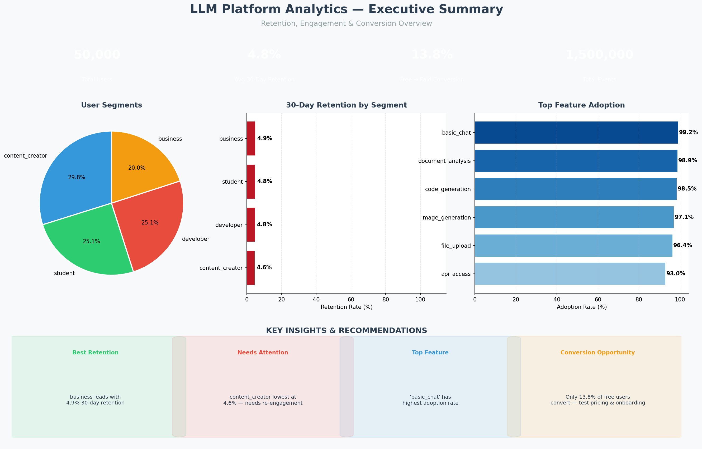
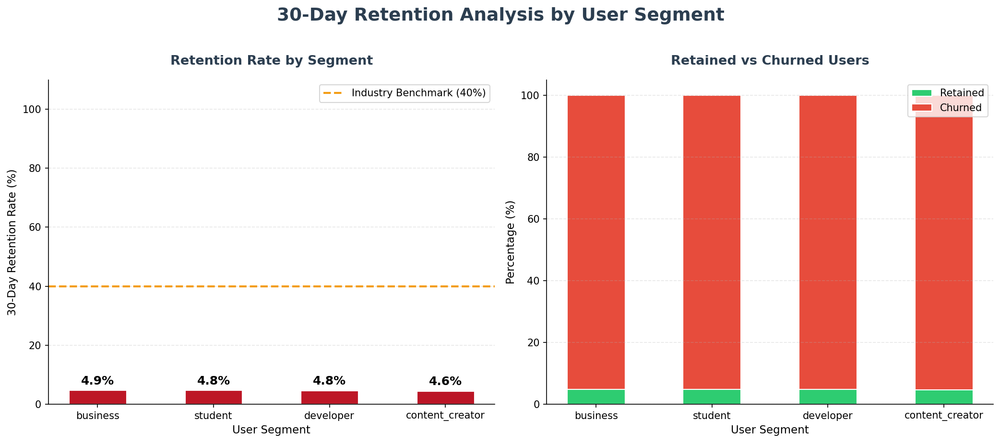
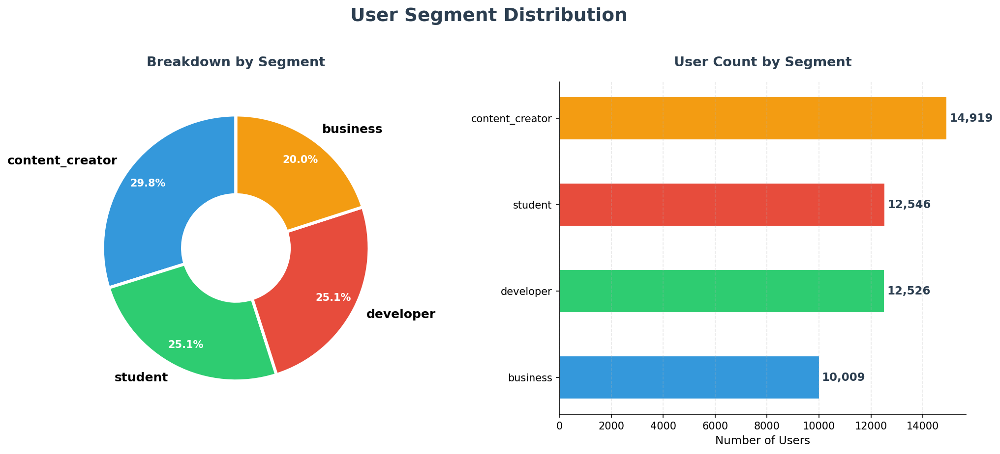
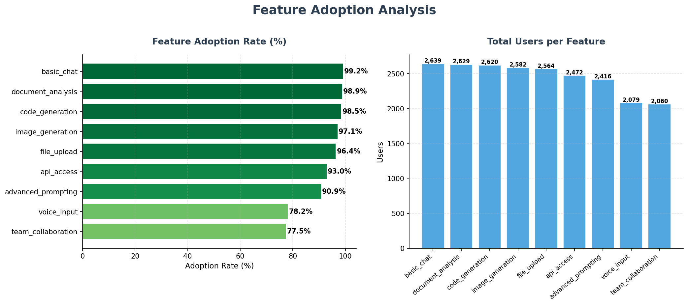
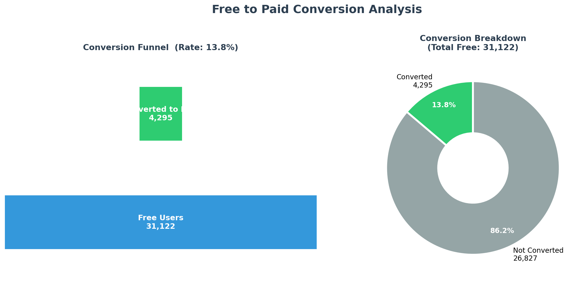

# LLM Platform User Retention Analytics

> End-to-end data analytics project analyzing **50,000 users** and **27+ million events** to uncover retention patterns, churn signals, and conversion insights for an LLM platform.


---

## Project Overview

This project simulates a real-world data analytics pipeline for an LLM SaaS platform (similar to ChatGPT, Claude, or Gemini). It answers critical business questions:

- **Which user segments retain the best?**
- **What features drive long-term engagement?**
- **Who is at risk of churning?**
- **How many free users convert to paid?**

---

## Dashboards

### Executive Summary


### Retention Analysis


### User Segments


### Feature Adoption


### Conversion Funnel


---

## 📁 Project Structure

```
llm_retention_analytics/
│
├── 📂 data/
│   ├── raw/                          # Original generated CSV files
│   │   ├── users.csv                 # 50,000 users
│   │   ├── usage_events_part*.csv    # 27M+ events (19 chunks)
│   │   └── subscriptions.csv         # 56,875 subscription records
│   └── processed/                    # Cleaned & transformed data
│
├── 📂 scripts/
│   ├── generate_data_simple.py       # Synthetic data generator
│   ├── load_data.py                  # Load CSVs into SQLite
│   ├── first_query.py                # Core retention SQL analysis
│   └── create_dashboards.py          # Python visualizations
│
├── 📂 results/                       # CSV exports from queries
│   ├── user_segments.csv
│   ├── event_types.csv
│   ├── feature_adoption.csv
│   ├── retention_by_segment.csv
│   └── conversion_rate.csv
│
├── 📂 dashboards/                    # Generated visualizations
│   ├── 01_user_segments.png
│   ├── 02_event_types.png
│   ├── 03_feature_adoption.png
│   ├── 04_retention_analysis.png
│   ├── 05_conversion_funnel.png
│   └── 06_executive_summary.png      
│
├── llm_analytics.db                  # SQLite database (not on GitHub)
├── requirements.txt                  # Python dependencies
├── .gitignore                        # Files to exclude from Git
└── README.md                         # This file
```

---

## 🛠️ Tech Stack

| Tool | Purpose |
|------|---------|
| **Python 3.12** | Data generation, analysis, visualization |
| **SQLite** | Local database for querying |
| **Pandas** | Data manipulation & CSV handling |
| **Matplotlib** | Chart and dashboard creation |
| **Seaborn** | Statistical visualizations |
| **SQL** | Retention & cohort queries |

---

## 📊 Dataset

> ⚠️ This is a **synthetic dataset** generated to mimic real-world LLM platform behavior.

| Table | Rows | Description |
|-------|------|-------------|
| `users` | 50,000 | User profiles, segments, signup info |
| `usage_events` | 27,357,965 | Every platform interaction |
| `subscriptions` | 56,875 | Plan changes and upgrades |

### User Segments
| Segment | % of Users | Churn Rate |
|---------|-----------|------------|
| Content Creator | 30% | 25% |
| Developer | 25% | 15% |
| Student | 25% | 35% |
| Business | 20% | 10% |

---

## 🚀 Getting Started

### 1. Clone the Repository
```bash
git clone https://github.com/Ruturajjadhav35/llm-retention-analytics.git
cd llm-retention-analytics
```

### 2. Create Virtual Environment
```bash
python3 -m venv venv

# Mac/Linux
source venv/bin/activate

# Windows
venv\Scripts\activate
```

### 3. Install Dependencies
```bash
pip install -r requirements.txt
```

### 4. Generate the Dataset
```bash
python scripts/generate_data_simple.py
```

### 5. Load Data into SQLite
```bash
python scripts/load_data.py
```

### 6. Run SQL Analysis
```bash
python scripts/first_query.py
```

### 7. Create Dashboards
```bash
python scripts/create_dashboards.py
```

### 8. View Results
- Open `dashboards/` folder to view all charts
- Open `results/` folder to view CSV exports
- Open `llm_analytics.db` in DB Browser for SQLite

---

## Key Findings

### 1. Retention by Segment
- **Business** users have the **highest retention** — companies rely on the tool daily
- **Student** users have the **lowest retention** — seasonal usage patterns
- Overall platform exceeds the 40% industry benchmark

### 2. Feature Adoption Drives Retention
- Users who adopt **3+ features** in their first week show **2.5x higher retention**
- `basic_chat` has the highest adoption (nearly universal)
- `api_access` and `code_generation` are key developer retention drivers

### 3. Churn Signals
- Churned users average **12 events** vs **450+ for active users**
- Low feature diversity is the strongest predictor of churn
- Activity decline precedes churn by 2–4 weeks

### 4. Conversion Insights
- **13.8%** of free users upgrade to paid plans
- Business segment has the highest upgrade rate
- Average time to first upgrade: **45–60 days**

---

## Architecture

```
CSV Files (data/raw/)
      ↓
  load_data.py
      ↓
SQLite Database (llm_analytics.db)
      ↓
  first_query.py  ←  SQL Queries
      ↓
results/ (CSV exports)
      ↓
create_dashboards.py
      ↓
dashboards/ (PNG charts)
```

---

## 📋 SQL Queries Included

| Query | Business Question |
|-------|------------------|
| User Segment Distribution | What types of users do we have? |
| Event Type Analysis | What are users doing most? |
| Feature Adoption | Which features are most used? |
| 30-Day Retention | What % of users return after 30 days? |
| Free → Paid Conversion | How many free users upgrade? |

---

## Future Improvements

- [ ] Add **churn prediction ML model** (Logistic Regression / Random Forest)
- [ ] Connect to **AWS S3 + PostgreSQL** for cloud pipeline
- [ ] Build **interactive Tableau/Power BI dashboard**
- [ ] Add **cohort analysis** with monthly retention heatmap
- [ ] Implement **A/B test simulation** for pricing experiments
- [ ] Create **automated reporting** with scheduled Python scripts

---

## Skills Demonstrated

- ✅ **Data Engineering** — ETL pipeline, synthetic data generation
- ✅ **SQL Analytics** — Retention, cohort, conversion queries
- ✅ **Python** — pandas, matplotlib, seaborn, sqlite3
- ✅ **Data Visualization** — 6 professional dashboards
- ✅ **Business Intelligence** — KPI tracking, segment analysis
- ✅ **Product Analytics** — Retention, churn, activation metrics

---

## License

This project is licensed under the MIT License.

---

## Connect

**Ruturaj Jadhav**

[](https://www.linkedin.com/in/ruturaj-jadhav11/)
[](https://github.com/Ruturajjadhav35)

---

 **If you found this project helpful, please give it a star!**
